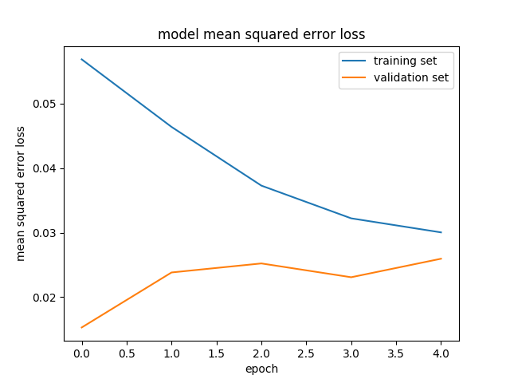

# **Behavioral Cloning**

## Writeup Template

<!-- ###You can use this file as a template for your writeup if you want to submit it as a markdown file, but feel free to use some other method and submit a pdf if you prefer. -->

---

**Behavrioal Cloning Project**

The goals / steps of this project are the following:
* Use the simulator to collect data of good driving behavior
* Build, a convolution neural network in Keras that predicts steering angles from images
* Train and validate the model with a training and validation set
* Test that the model successfully drives around track one without leaving the road
* Summarize the results with a written report


[//]: # (Image References)

[image1]: ./examples/placeholder.png "Model Visualization"
[image2]: ./examples/placeholder.png "Grayscaling"
[image3]: ./examples/placeholder_small.png "Recovery Image"
[image4]: ./examples/placeholder_small.png "Recovery Image"
[image5]: ./examples/placeholder_small.png "Recovery Image"
[image6]: ./examples/placeholder_small.png "Normal Image"
[image7]: ./examples/placeholder_small.png "Flipped Image"
[steering_visualization]: ./examples/steering_visualization.png "Steering Visualization"
[steering_histogram]: ./examples/steering_histogram.png
[preprocess_image]: ./examples/preprocess_image.png "preprocessed Image"

## Rubric Points
### Here I will consider the [rubric points](https://review.udacity.com/#!/rubrics/432/view) individually and describe how I addressed each point in my implementation.  

---
### Files Submitted & Code Quality

#### 1. Submission includes all required files and can be used to run the simulator in autonomous mode

My project includes the following files:
* `model.py` containing the script to create and train the model
* `helper.py` containing the helper functions for model like generating data and loading csv files.
* `drive.py` for driving the car in autonomous mode
* `model.h5` containing a trained convolution neural network
* `writeup_report.md` or `writeup_report.pdf` summarizing the results
* `get_data.sh` to download the Udacity provided dataset

#### 2. Submssion includes functional code
Using the Udacity provided simulator and my drive.py file, the car can be driven autonomously around the track by executing
```sh
python drive.py model.h5
```

#### 3. Submssion code is usable and readable

The `model.py` file contains the code for training and saving the convolution neural network. `helper.py`file shows the pipeline I used for training and validating the model, loading data from csv file, and it contains comments to explain how the code works.


### Model Architecture and Training Strategy

#### 1. An appropriate model arcthiecture has been employed

My model consists of a convolution neural network with 3x3 filter sizes and depths between 16 and 64 (model.py lines 20-35). My model is based upon [Navoshta's Model](http://navoshta.com/end-to-end-deep-learning/)

The model includes RELU layers to introduce nonlinearity (code line 23).

#### 2. Attempts to reduce overfitting in the model

The model contains dropout layers in order to reduce overfitting (model.py lines 31).

The model was trained and validated on udacity provided data sets to ensure that the model was not overfitting (code line 41-59). The model was tested by running it through the simulator and ensuring that the vehicle could stay on the track, though a speed cap of 14 Km/h was set on the vehicle to avoid zig zag motion as vehicle was not behaving correctly.

#### 3. Model parameter tuning

The model used an adam optimizer, so the learning rate was set to  `0.0001` (model.py lines 36-37 ).

#### 4. Appropriate training data

Training data was same as provided Udacity provided data which was good but was very unbalanced. Though shuffling data and augmenting helps overcome this issue. (helper.py lines 55-59).
Data is stored in the directory named `data/`

```python
import matplotlib.pyplot as plt
import pandas as pd
plt.style.use('ggplot')

df = pd.read_csv("data/driving_log.csv")
df.steering.plot()
df.steering.hist()
plt.show()
```

![Steering Visualization][steering_visualization]
![Steering Histogram][steering_histogram]
### Model Architecture and Training Strategy

#### 1. Solution Design Approach

The overall strategy for deriving a model architecture was to ...

My first step was to use a convolution neural network model similar to the [Nvidia's End to End Deep Learning Model](https://images.nvidia.com/content/tegra/automotive/images/2016/solutions/pdf/end-to-end-dl-using-px.pdf). I thought this model might be appropriate because it was tried and tested by Nvidia but then switched to [Navoshta's Model](http://navoshta.com/end-to-end-deep-learning/) since it was used for this particular problem and results were pretty good and this model is also based upon Nvidia's model.

In order to gauge how well the model was working, I split my image and steering angle data into a training and validation set. I found that model worked really well for 5 - 10 epochs but it was overfitting for 20 epochs.

To combat the overfitting, I modified the model so that I used data augmentation but avoided brightness augmentation since it was confusing the model.


Then I trained the model with different number of epochs and [augmentation techniques](chatbotslife.com/using-augmentation-to-mimic-human-driving-496b569760a9#.c9jbs5ku0)

The final step was to run the simulator to see how well the car was driving around track one. There were a few spots where the vehicle fell off the track, specially at the end of the lap and bridges (generally places with sharp turns) to improve the driving behavior in these cases, I increased the number of epochs and it drove pretty well.

At the end of the process, the vehicle is able to drive autonomously around the track without leaving the road.

####2. Final Model Architecture

The final model architecture (model.py lines 18-24) consisted of a convolution neural network with the  3 convolutional layers and 3 fully connected layers.

#### 3. Creation of the Training Set & Training Process

Although we can generate data by recording from the simulator. It's difficult to produce a good dataset at a constant speed, so I used Udacity provided dataset.


To augment the data set, I also flipped images and angles thinking that this would help model genralize and make up for the limited dataset. For example, here is an image that has then been preprocesed and applying other  [augmentation ](chatbotslife.com/using-augmentation-to-mimic-human-driving-496b569760a9#.c9jbs5ku0),
[techniques](http://navoshta.com/end-to-end-deep-learning/)

```python
import pandas as pd
import numpy as np
import matplotlib.pyplot as plt
import matplotlib.image as mpimg
import helper # Local helper class

# Read data frame
df = helper.read_data()
random_index = np.random.randint(0,len(df))
# Read all camera images for a particular frame
l,c,r = df.ix[random_index][['left','center','right']]
l,c,r = mpimg.imread("data/"+l.strip()),mpimg.imread("data/" +c.strip()),mpimg.imread("data/" +r.strip())
l,c,r = helper.preprocess_image(l,training=True),helper.preprocess_image(c,training=True),helper.preprocess_image(r,training=True)
plt.imshow(l)  # Show left image for example
plt.show()
```

![Preprocessed Image][preprocess_image]


I then preprocessed this data by preprocessing each frame by cropping top and bottom of the image and resizing to a shape our model expects (32×128×3, RGB pixel intensities of a 32×128 image). The resizing operation also takes care of scaling pixel values to [0, 1]. (helper.py lines 61-68)


I finally randomly shuffled the data set and put 20% of the data into a validation set. (model.py line 46)
`df_train, df_valid = train_test_split(df, test_size=0.2)`

I used this training data for training the model. The validation set helped determine if the model was over or under fitting. The ideal number of epochs was 10 as evidenced by four days of tweaking. I used an adam optimizer with a learning rate of `0.0001`
